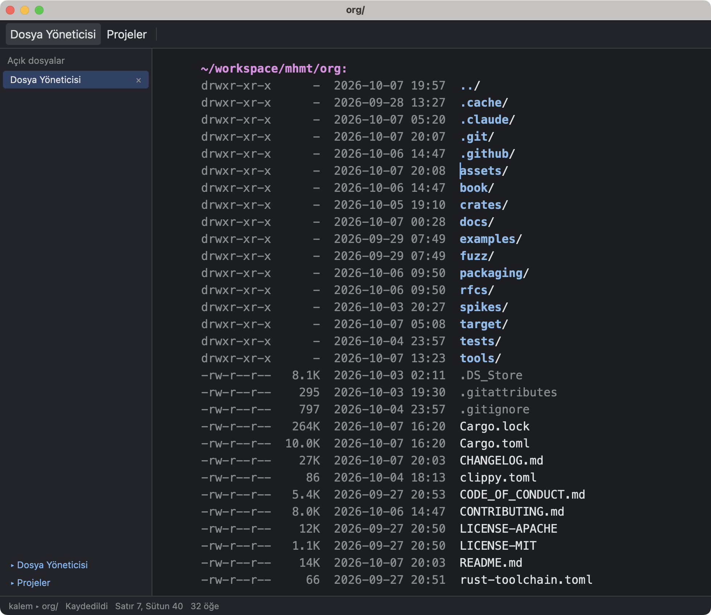
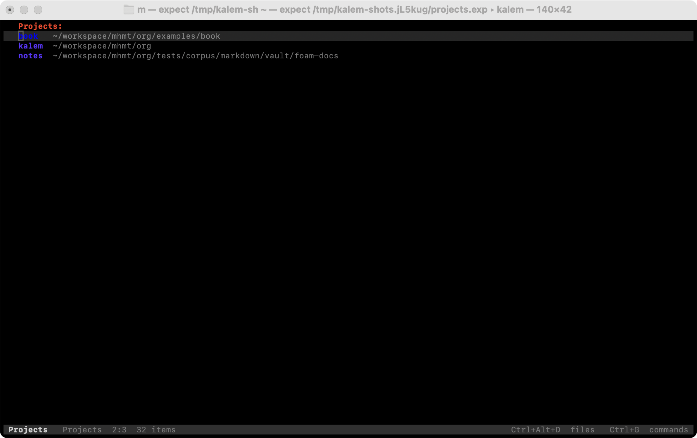
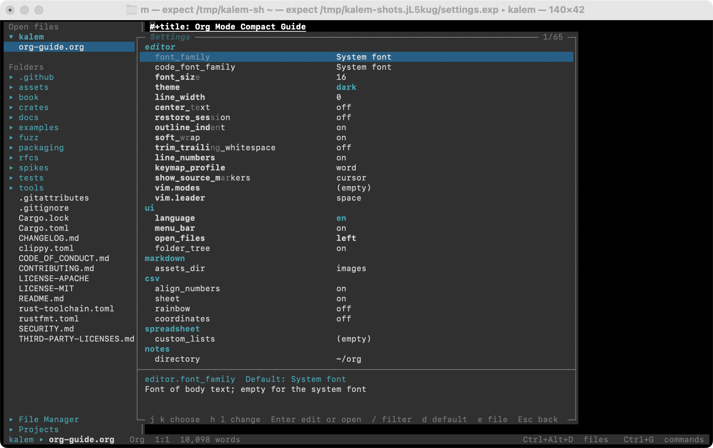

<p align="center">
  
</p>

<h1 align="center">Kalem</h1>

<p align="center">One fast editor for all the files of your work, instead of one program per format. Written in Rust. In a window and in a terminal.</p>

<p align="center"></p>

Kalem (Turkish for "pen") shows a file the way it reads and never touches what you did not edit. A Markdown, Org, LaTeX or CSV file opens as what it is, a document or a grid, and under it the file stays plain text, byte for byte. PDF files, pictures and Excel workbooks open in viewers next to your documents, plugins installed the first time you open such a file; every other text file opens as code. A format Kalem does not know yet is a plugin away, written in Rust: you read and edit it here too, in the same editor.

**Status: alpha.** It is in daily use, and it has rough edges. The current release installs [below](#install). An [issue](https://github.com/getkalem/kalem/issues) with the file that went wrong, when you can share it, helps most.

## Why Kalem

- **Every file as itself, and the file stays yours.** Kalem never converts a file to open it (workbooks in `.ods`, `.xls` or `.xlsb` are the one exception, below), writes nothing into a file that its format does not define, and shows what it does not understand as the source it is. It edits the text in place and saves only what you changed, byte for byte: no database, no import, no "save as", no account, no cloud. Open the file in another editor, or in `git diff`, and you see only your edits.
- **Checked against the reference, on thousands of files.** Org against Emacs itself; LaTeX on 925 arXiv papers and 21 real projects, the HoTT book and the Stacks project among them; Markdown on every example of the CommonMark and GFM test suites; CSV on files written by Excel, LibreOffice and Google Sheets. On the way the project wrote the specification LaTeX never had: [LaTeX as written](book/appendices/latex-as-written.org).
- **Fast.** Kalem is written in Rust: one binary, no runtime, no scripting engine. A keystroke in a paragraph reparses it in a twentieth of a millisecond. The [measurements](book/part-4/performance.org) give every number with the command that reproduces it.
- **One editor, in a window and in a terminal.** The same documents, commands and keys in the graphical editor and in `kalem tui`, over SSH too. Every operation on a document is also a command on the command line: `kalem check`, `kalem fmt`, `kalem export`.
- **Vim keys if you want them, menus if you do not.** Vim's modes, motions, operators, registers, macros and command line are built in, checked against Vim itself, and one setting turns them on; the default keys are the ones most editors use. Either way a menu bar, a toolbar, right-click menus, a command palette and the mouse reach every command, in the terminal too.
- **Plugins in Rust, not JavaScript.** A plugin is compiled Rust, run as a WebAssembly component with its own memory, a time budget and only the permissions it declares. Plugins run fast, and a plugin cannot freeze the editor or take it down.

## Documents

Five formats are built into the core, each with a chapter in the Book's [Part II](book/part-2/overview.org) that says exactly what Kalem reads, shows, edits and writes, and against what it is tested.

| File | What you see |
|---|---|
| `.md`, `.markdown`, `.mdown`, `.mkd`, `.gfm` | A document, GitHub flavor: headings, lists, task lists, tables with formulas, front matter, wiki links, pictures. Markers hide away from the cursor and come back when you reach them. A folder of notes with wiki links between them works as a project. |
| `.org` | A document: folding, TODO states, dates, tags, tables with formulas, footnotes, citations, typeset formulas. Export to HTML, Markdown, LaTeX, PDF and text as Emacs does; Word, OpenDocument and EPUB through pandoc, and `kalem import` brings Word, OpenDocument, HTML, EPUB and RTF files in as Org the same way. |
| `.tex`, `.latex`, `.ltx` | A document: numbered sections, typeset formulas, references, citations, figures; what Kalem does not understand stays as source. Build the PDF with the errors at their lines, and Ctrl-click a line of the PDF to go back to the source. |
| `.csv`, `.tsv`, `.tab` | A grid: sorting, filters, a record view, column statistics. Only the fields you edit are written. |
| `.bib` | A grid of entries. |
| Anything else | Code with highlighting. |

Around them: a file manager, projects, find in files, a command palette, an outline, split views, themes, and the interface in English and Turkish.

<table>
  <tr>
    <td></td>
    <td></td>
  </tr>
  <tr>
    <td></td>
    <td></td>
  </tr>
</table>
<p align="center"><i>A Markdown note and the Org guide; a LaTeX article and a CSV file.</i></p>

## Viewers and plugins

Files that are not text open through plugins of [getkalem/plugins](https://github.com/getkalem/plugins), none of them built into Kalem: the first time you open a PDF, a picture or a workbook, Kalem names the plugin that opens it and installs it if you choose, then opens the file (`kalem plugin install xlsx` installs one ahead of time). So you do not leave the editor to look at the files next to your document:

| File | What you see |
|---|---|
| `.pdf` | Pages, zoom, search, text selection, the outline, links; a password when the file asks for one. |
| Pictures | PNG, JPEG, GIF, WebP, TIFF and a dozen more: fit, zoom, rotate, next and previous in the folder. In the terminal too, where the terminal draws pictures (kitty, Ghostty, WezTerm, iTerm2, Sixel). An SVG file, being text, opens as its XML; it shows as a picture where a document links it. |
| `.xlsx`, `.xlsm`, `.xltx`, `.xltm` | Sheets as grids with their formulas, styles, charts and pivot tables, edited and saved as the same file; a save asks Excel to recalculate when it opens the file. An `.ods`, `.xls` or `.xlsb` workbook is converted as it opens: saving it back in its own format asks first, and Save As `.xlsx` leaves the original alone. |

<table>
  <tr>
    <td></td>
    <td></td>
  </tr>
</table>
<p align="center"><i>The PDF built from the article, and a workbook with its formulas and its chart.</i></p>

Programming languages come as plugins too: the syntax, and a language server for diagnostics, completion, hover, rename, code actions and formatting. Today there is one, for Elixir (with Expert or ElixirLS); more follow.

```bash
kalem plugin install elixir
```

If your format is not here, a plugin adds it: `kalem plugin browse` lists the plugins of the index, and `kalem plugin new` starts your own, in Rust. The plugins live in [getkalem/plugins](https://github.com/getkalem/plugins); the Book's [Part III](book/part-3/overview.org) has the contract.

## From Emacs, for everyone

Kalem's author used Emacs for many years. Emacs got a lot right: its packages are open code that hundreds of people refined over decades, and some of them became very good, Dired, Magit, Projectile and Org mode among them. But Emacs is made for programmers, everything hides behind key chords, and everything runs on one thread of Lisp, so one busy package stalls the whole editor. Kalem takes the parts that worked best and builds them into its core, not on top, as an everyday program for everyone:

- **Org mode**, compared with Emacs command by command.
- **A file manager**, as Dired: a folder as a page of text, every file with its size and date. Open a file, rename it by editing its name, copy, move or trash it, select many at once; Ctrl+Alt+D lists the document's folder with the cursor on its file.
- **Projects**, as Projectile has them: each piece of your work kept apart. Any file of the project opens by a few letters of its name (Ctrl+P), a search goes through all of it (Ctrl+Shift+F), and another project is one step away.
- **Leader keys** with the Vim keys, in Doom Emacs's layout: Space is the leader, `SPC p p` switches the project, and a panel shows what can follow a prefix, as which-key does.

<table>
  <tr>
    <td></td>
    <td></td>
  </tr>
  <tr>
    <td colspan="2" align="center"></td>
  </tr>
</table>
<p align="center"><i>The file manager, the projects view, and the settings panel with its lazygit-like keys.</i></p>

You do not need to be an Emacs user, and nothing has to be learned first: the interface most people know is there, a menu bar, tabs, a folder tree, a command palette, right-click menus, Ctrl+S. Every setting, the plugins' included, is changed in a settings panel (Ctrl+, or Cmd+,): a switch flipped or the next choice picked in place, with lazygit's keys in the terminal, nothing typed into a file. The panel saves to `settings.toml`, and `keymap.json` changes any key. What Kalem leaves out is Elisp: there is no scripting engine. The Book's [Kalem and Emacs](book/part-4/kalem-and-emacs.org) says what is taken, what is left out, and why.

For Emacs and Vim hands: `editor.keymap_profile = "vim"` turns the Vim keys on, and every key of Doom's leader map is listed with what it does in Kalem ([Keys](book/part-1/keys.org)); the file manager has Dired's keys ([The file manager](book/part-1/the-file-manager.org)); [`docs/keymaps/emacs.json`](docs/keymaps/emacs.json) is a complete keymap with Org mode's Emacs keys to copy from.

## Install

On macOS and Linux:

```bash
curl --proto '=https' --tlsv1.2 -LsSf https://github.com/getkalem/kalem/releases/latest/download/kalem-editor-installer.sh | sh
```

On Windows, in PowerShell:

```powershell
powershell -ExecutionPolicy Bypass -c "irm https://github.com/getkalem/kalem/releases/latest/download/kalem-editor-installer.ps1 | iex"
```

The installers put `kalem` in `~/.cargo/bin`; delete it there to uninstall. The release also has terminal-only archives (`kalem-terminal-*`) for servers, without the graphical editor and the plugin host, so without viewers. The Book's [Installing](book/part-1/installing.org) has the details: glibc 2.35 or later on Linux, the unsigned `Kalem.app` on macOS, and the libraries a build from source needs.

From source, with Rust 1.96 or later:

```bash
git clone https://github.com/getkalem/kalem && cd kalem
cargo install --locked --path crates/kalem
```

```bash
kalem notes.md                      # the editor; `kalem tui notes.md` for the terminal
kalem export notes.org --to html    # the command-line tools: check, fmt, query, export…
```

Settings live in `~/.config/kalem` on Linux and macOS (`$XDG_CONFIG_HOME/kalem` if it is set) and in `%APPDATA%\kalem` on Windows; the log and crash reports in `~/.local/state/kalem`, or `%LOCALAPPDATA%\kalem`. `KALEM_CONFIG_DIR` and `KALEM_STATE_DIR` move them, and `KALEM_LOG=debug` makes the log say more.

## Not yet

- The Org agenda.
- Language plugins beyond Elixir.
- Signed installers and a macOS app in the release; a Windows MSI; Linux AppImage and Flatpak packages.

## Limits

- Markdown: export, printing and `kalem fmt` are for Org and LaTeX; TOML front matter (`+++`) and `$$` blocks over several lines show as text.
- LaTeX: building a PDF needs TeX Live, MiKTeX or Tectonic installed; Kalem does not download one.
- The terminal-only build has no viewers and no plugin host, and draws an SVG picture without its text.
- Line endings and a byte order mark stay as the file has them; there is no command to change them yet.
- An `.ods`, `.xls` or `.xlsb` workbook is converted to be edited, and a workbook with a password to open is saved as `.ods` without its encryption.

## More

- [The Kalem Book](https://getkalem.github.io/kalem): the manual, and what Kalem does with each format.
- [Contributing](CONTRIBUTING.md), the [design documents and task list](docs/README.md), the [changelog](CHANGELOG.md).
- License: MIT or Apache-2.0, at your option.
