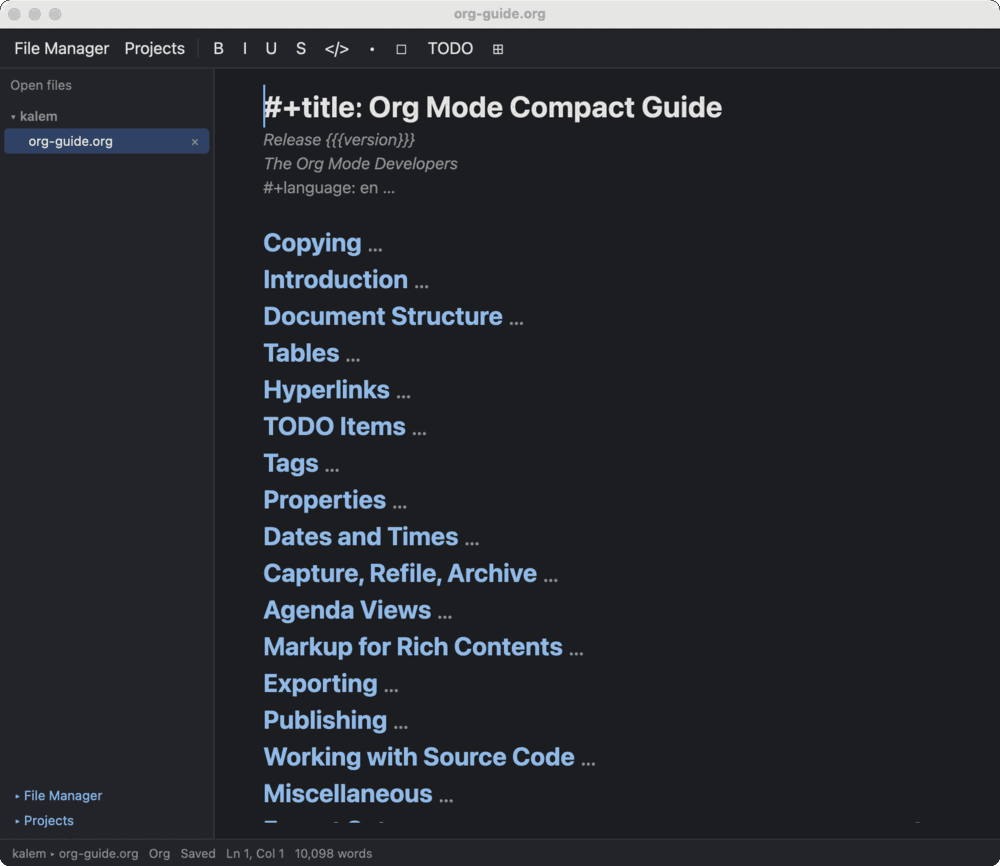
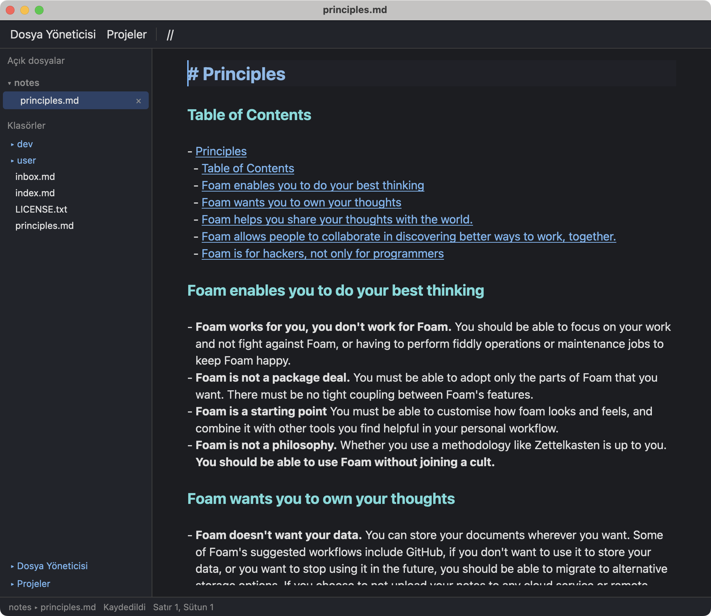
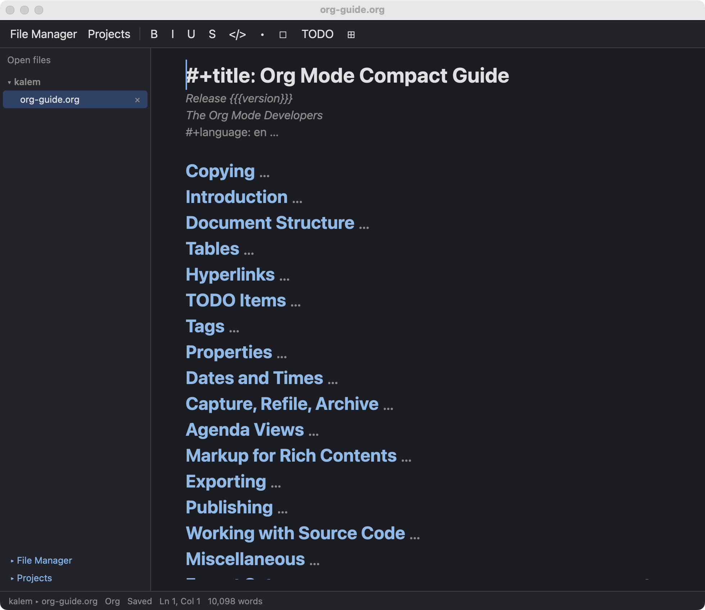
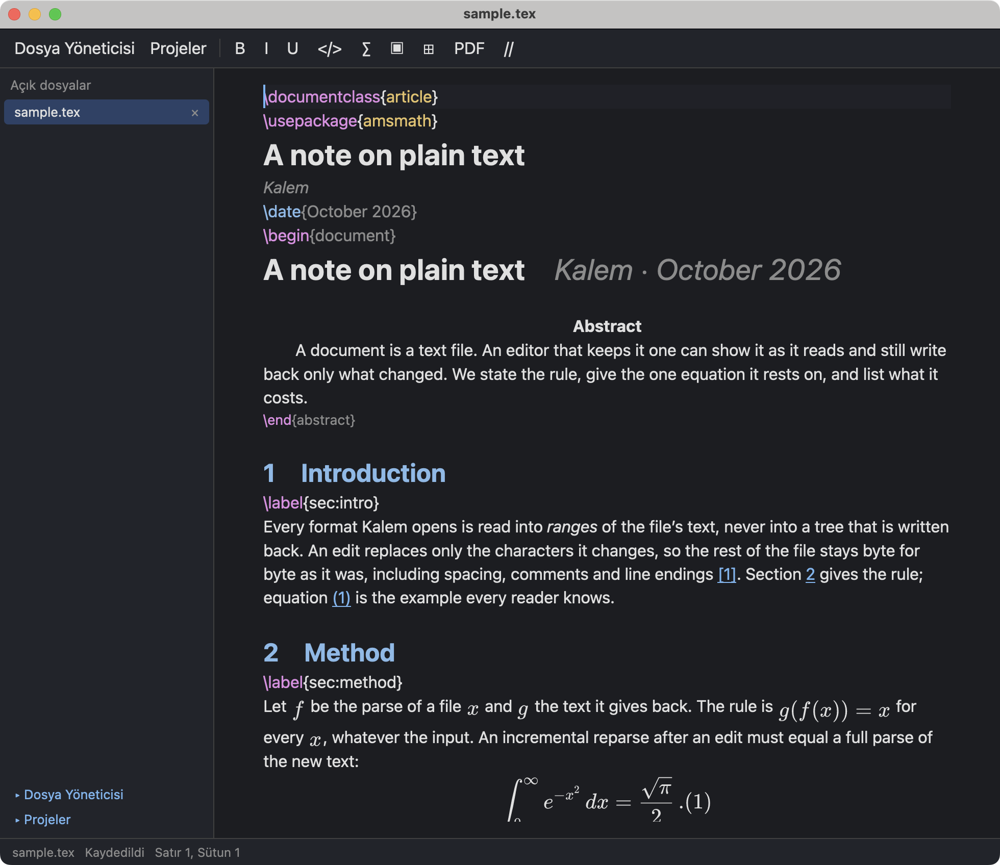
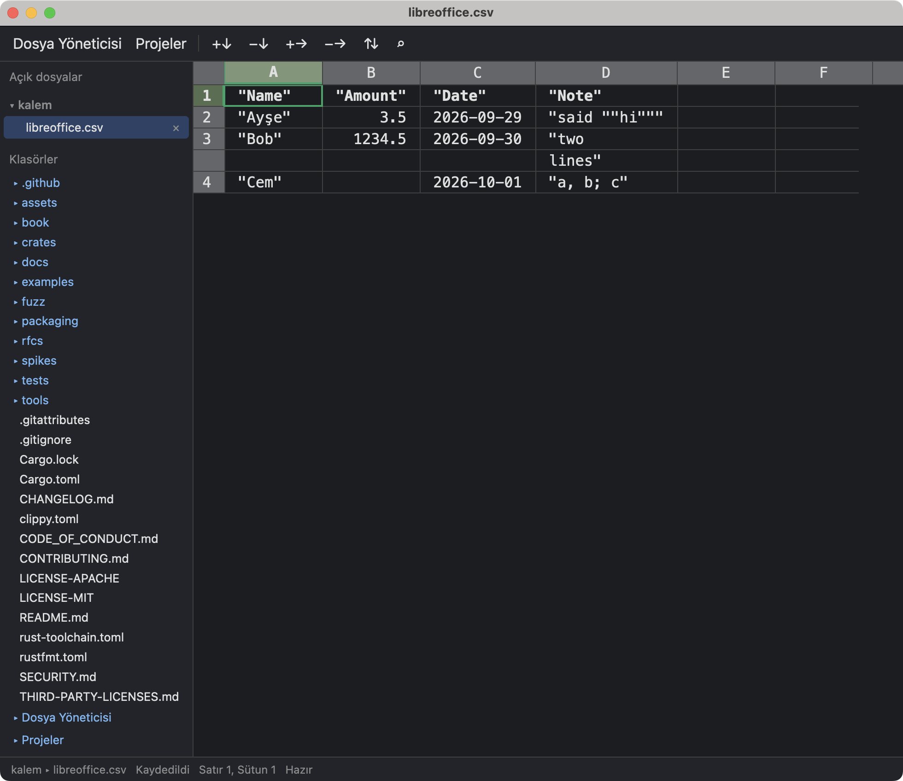
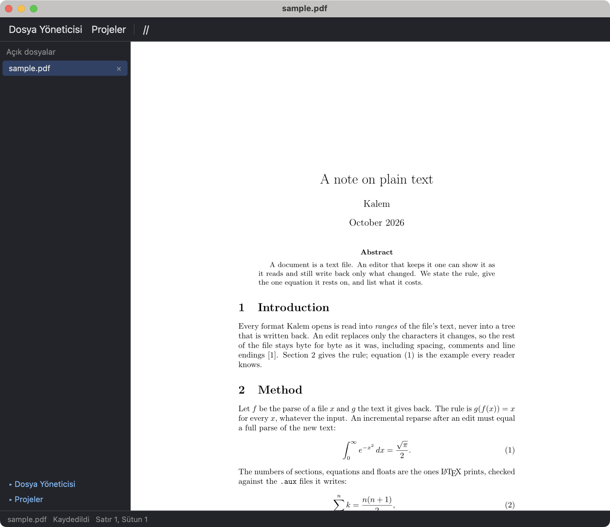
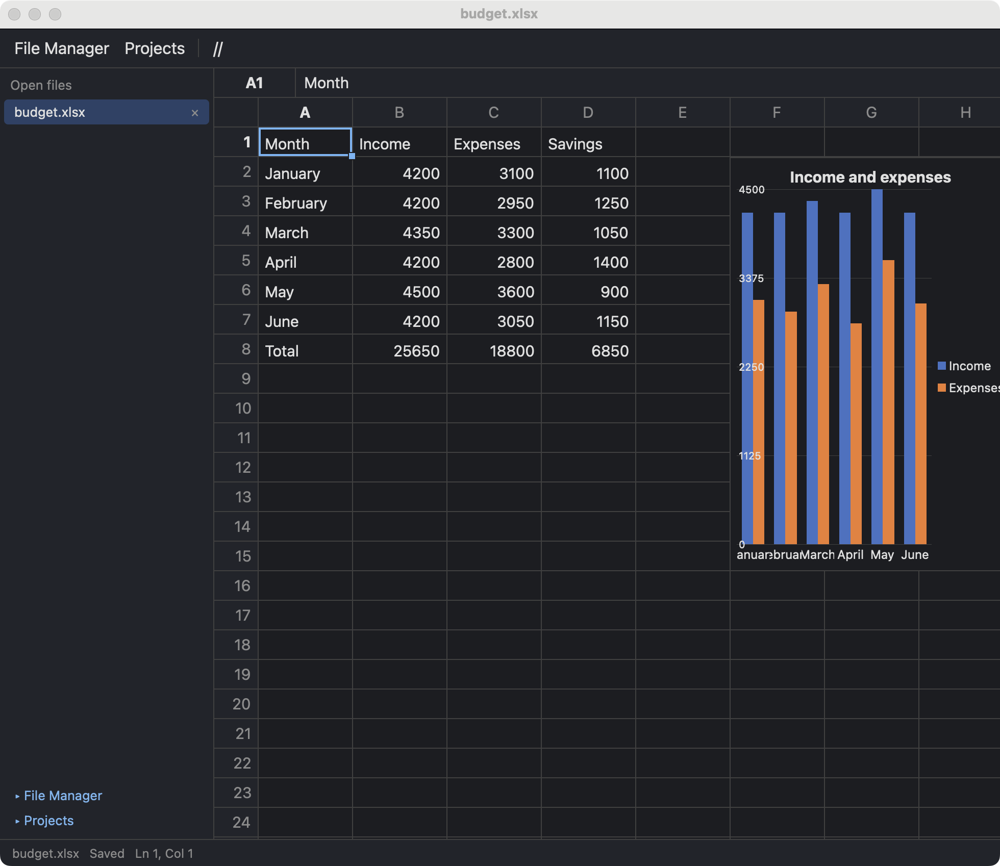

<p align="center">
  
</p>

<h1 align="center">Kalem</h1>

<p align="center">One fast editor for all the files of your work, instead of one program per format. Written in Rust. In a window and in a terminal.</p>

<!-- The GIF of the same file in both editors (docs/todo.md T1.8.7), made by tools/readme-screenshots.sh, goes here once it is recorded:
<p align="center"></p>
-->

Kalem (Turkish for "pen") opens a Markdown, Org, LaTeX or CSV file as what it is: a document or a grid. Bold text reads as bold, a formula is typeset, a table is a table. Under it the file stays plain text, byte for byte. PDF files, pictures and Excel workbooks open in viewers, next to your documents. Every other text file opens as code. A format Kalem does not know yet is a plugin away, written in Rust: you read and edit it here too, in the same editor.

**Status: alpha.** It works every day, and it has rough edges. The current release installs [below](#install). An [issue](https://github.com/getkalem/kalem/issues) with the file that went wrong, when you can share it, helps most.

## Why Kalem

- **Every file as itself.** Kalem never converts a file to open it. A Markdown file opens as Markdown, a CSV file as a grid, a LaTeX file as the document it typesets, an Excel workbook as a workbook. Kalem writes nothing into a file that its format does not define, and what it does not understand it shows as the source it is, never hidden and never guessed.
- **The file stays yours.** Kalem edits the text in place and saves only what you changed, byte for byte. No database, no import, no "save as". Open the file in another editor, or in `git diff`, and you see only your edits.
- **Checked against the reference, on thousands of files.** Org is compared with Emacs itself, command by command and export by export, on thousands of Org files. LaTeX is read on 925 arXiv papers and 21 real projects (the HoTT book, the Stacks project, the C++ standard's draft…): every file parses back to its own bytes after tens of thousands of edits, the numbering is checked against pdflatex and the structure against pandoc. On the way the project wrote the specification LaTeX never had, [LaTeX as written](book/appendices/latex-as-written.org): what a document means as authors write it, independent of Kalem. Markdown agrees with every example of the CommonMark and GFM test suites, and CSV is round-tripped on files written by Excel, LibreOffice and Google Sheets.
- **Fast.** Kalem is written in Rust: one binary, no runtime, no scripting engine. A keystroke in a paragraph reparses it in a twentieth of a millisecond. The [measurements](book/part-4/performance.org) give every number with the command that reproduces it.
- **One editor, in a window and in a terminal.** The same documents, commands and keys in the graphical editor and in `kalem tui`, over SSH too. Every operation on a document is also a command on the command line: `kalem check`, `kalem fmt`, `kalem export`.
- **Vim keys if you want them, menus if you do not.** Vim's modes, motions, operators, text objects, registers, macros and command line are built in, checked against Vim itself, and one setting turns them on. The default keys are the ones most editors use: Ctrl+S, Ctrl+Z, Ctrl+F. Either way you are not tied to shortcuts: a menu bar, a toolbar, a command palette and the mouse reach every command, in the terminal too (F10 opens the menus there).
- **Plugins in Rust, not JavaScript.** A plugin is compiled Rust, run as a WebAssembly component with its own memory, a time budget and only the permissions it declares. Plugins run fast, and a plugin cannot freeze the editor or take it down.

## Documents

Five formats are built into the core. Each has a chapter in the Book's [Part II](book/part-2/overview.org) that says exactly what Kalem reads, shows, edits and writes, and against what it is tested.

| File | What you see |
|---|---|
| `.md` Markdown | A document, GitHub flavor: headings, lists, task lists, tables with formulas, front matter, wiki links, pictures. Markers hide away from the cursor and come back when you reach them. A folder of notes with wiki links between them works as a project. |
| `.org` Org | A document: folding, TODO states, dates, tags, tables with formulas, footnotes, citations, typeset formulas. Export to HTML, Markdown, LaTeX, PDF and text as Emacs does; Word, OpenDocument and EPUB through pandoc. |
| `.tex` LaTeX | A document: numbered sections, typeset formulas, references, citations, figures; what Kalem does not understand stays as source. Build the PDF with the errors at their lines, and Ctrl-click a line of the PDF to go back to the source. |
| `.csv`, `.tsv` | A grid: sorting, filters, a record view, column statistics. Only the fields you edit are written. |
| `.bib` BibTeX | A grid of entries. |
| Anything else | Code with highlighting. |

<!-- One picture per format, the graphical editor on a corpus file, made by tools/readme-screenshots.sh on a Mac with the Screen Recording permission (docs/todo.md T2.10.13). Take this comment away once the files exist:
<table>
  <tr>
    <td></td>
    <td></td>
  </tr>
  <tr>
    <td></td>
    <td></td>
  </tr>
</table>
-->

## Viewers and plugins

Three viewers are built into the binary as plugins, so you do not leave the editor to look at the files next to your document:

| File | What you see |
|---|---|
| `.pdf` | Pages, zoom, search, text selection, the outline, links; a password when the file asks for one. |
| Pictures | PNG, JPEG, GIF, WebP, TIFF and a dozen more: fit, zoom, rotate, next and previous in the folder. In the terminal too, where the terminal draws pictures (kitty, Ghostty, WezTerm, iTerm2, Sixel). |
| `.xlsx` Excel | Sheets as grids with their formulas, styles, charts and pivot tables, edited and saved as the same file. An `.ods`, `.xls` or `.xlsb` workbook is converted as it opens. |

<!-- Two more pictures from tools/readme-screenshots.sh; take this comment away once the files exist:
<table>
  <tr>
    <td></td>
    <td></td>
  </tr>
</table>
-->

Programming languages come as plugins too: the syntax, and a language server for diagnostics, completion, hover, rename, code actions and formatting. Today there is one, for Elixir (with Expert or ElixirLS); more follow.

```bash
kalem plugin install elixir
```

If your format is not here, a plugin adds it. `kalem plugin browse` lists the plugins of the index, and `kalem plugin new` starts your own, in Rust: a viewer, an editor for a format, or a language. The plugins live in [getkalem/plugins](https://github.com/getkalem/plugins); the Book's [Part III](book/part-3/overview.org) has the contract.

## From Emacs, for everyone

Kalem's author used Emacs for many years. The parts of the Emacs world that worked best are built into Kalem's core, not added on top:

- **Org mode.** The document mode above, compared with Emacs command by command.
- **Projects**, as Projectile has them: a project list, find a file in the project (Ctrl+P), search in the project (Ctrl+Shift+F), switch project.
- **A file manager**, as Dired: Ctrl+Alt+D lists the document's folder with the cursor on its file; marks, and renaming by editing the listing, as wdired does.
- **Leader keys** with the Vim keys, in Doom Emacs's layout: Space is the leader, `SPC p p` switches the project, `SPC SPC` finds a file in it, and a panel shows what can follow a prefix, as which-key does.

You do not need to be an Emacs user, and nothing has to be learned first. The interface most people know is there: a menu bar, tabs, a folder tree, a command palette, right-click menus, Ctrl+S. What Kalem leaves out is Elisp: there is no scripting engine; configuration is data in `settings.toml` and `keymap.json`, and every key can be changed. The Book's [Kalem and Emacs](book/part-4/kalem-and-emacs.org) says what is taken, what is left out, and why.

For Emacs and Vim hands, the details:

- **Vim keys.** `editor.keymap_profile = "vim"` in `settings.toml`, or the Keys row of the settings panel (Ctrl+,). Modes, motions, operators, text objects and counts, registers and macros, marks, search with Vim's patterns, and the command line with ranges, `:s`, `:g`, `:sort`, `:set` and the file and window commands. Fifteen thousand generated key sequences were run in Vim and in Kalem, and the text and cursor after them must agree ([Keys](book/part-1/keys.org), "Vim keys").
- **Doom's leader.** Every key of Doom's leader map is listed with what it does in Kalem, or why not yet ([Keys](book/part-1/keys.org), "Doom's leader map in Kalem").
- **Dired's keys** in the file manager: `e` edits the names in place, `* t` and the other marks, `K` takes an entry out of the listing ([The file manager](book/part-1/the-file-manager.org)).
- **Emacs's Org keys.** [`docs/keymaps/emacs.json`](docs/keymaps/emacs.json) is a complete keymap with Org mode's Emacs keys (`C-c C-t`, `C-c C-c`…) to copy from into your `keymap.json`; the hint panel follows `C-x` and `C-c` too ([Keys](book/part-1/keys.org), "Your own keys").

## Install

On macOS and Linux:

```bash
curl --proto '=https' --tlsv1.2 -LsSf https://github.com/getkalem/kalem/releases/latest/download/kalem-editor-installer.sh | sh
```

On Windows, in PowerShell:

```powershell
powershell -ExecutionPolicy Bypass -c "irm https://github.com/getkalem/kalem/releases/latest/download/kalem-editor-installer.ps1 | iex"
```

The installers put `kalem` in `~/.cargo/bin`; delete it there to uninstall. The release also has terminal-only archives (`kalem-terminal-*`): the terminal editor and the command-line tools, without the graphical editor, the viewers and the plugins; a server should take those. Both need glibc 2.35 or later on Linux (Ubuntu 22.04). On macOS the binary is not signed yet: a `Kalem.app` built from source with `tools/macos-app.sh` opens the first time with right-click and *Open*.

From source, with Rust 1.96 or later (on Linux the graphical editor also needs the development files listed in the Book's [Installing](book/part-1/installing.org)):

```bash
git clone https://github.com/getkalem/kalem && cd kalem
cargo install --locked --path crates/kalem
```

```bash
kalem notes.md                      # the editor; `kalem tui notes.md` for the terminal
kalem export notes.org --to html    # the command-line tools: check, fmt, query, export…
```

Settings live in `~/.config/kalem` on Linux and macOS (`$XDG_CONFIG_HOME/kalem` if it is set) and in `%APPDATA%\kalem` on Windows; the log and crash reports in `~/.local/state/kalem` (`$XDG_STATE_HOME/kalem`), or `%LOCALAPPDATA%\kalem`. `KALEM_CONFIG_DIR` and `KALEM_STATE_DIR` move them, and `KALEM_LOG=debug` makes the log say more.

## Not yet

- The Org agenda.
- Language plugins beyond Elixir.
- Signed installers and a macOS app in the release; a Windows MSI; Linux AppImage and Flatpak packages.
- Markdown: export, printing and `kalem fmt` are for Org and LaTeX; TOML front matter (`+++`) and `$$` blocks over several lines show as text.
- LaTeX: building a PDF needs TeX Live, MiKTeX or Tectonic installed; Kalem does not download one.
- The terminal-only build has no viewers and no plugin host.
- An `.ods`, `.xls` or `.xlsb` workbook is converted to be edited, and a workbook with a password to open is saved as `.ods` without its encryption.

## More

- [The Kalem Book](https://getkalem.github.io/kalem): the manual, and what Kalem does with each format.
- [Contributing](CONTRIBUTING.md), the [design documents and task list](docs/README.md), the [changelog](CHANGELOG.md).
- License: MIT or Apache-2.0, at your option.
